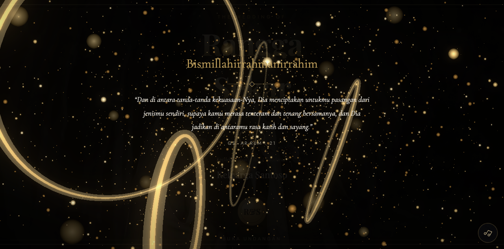
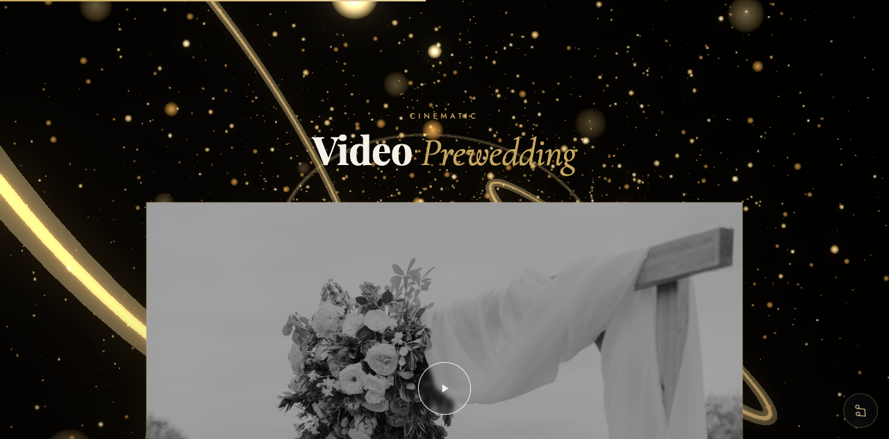
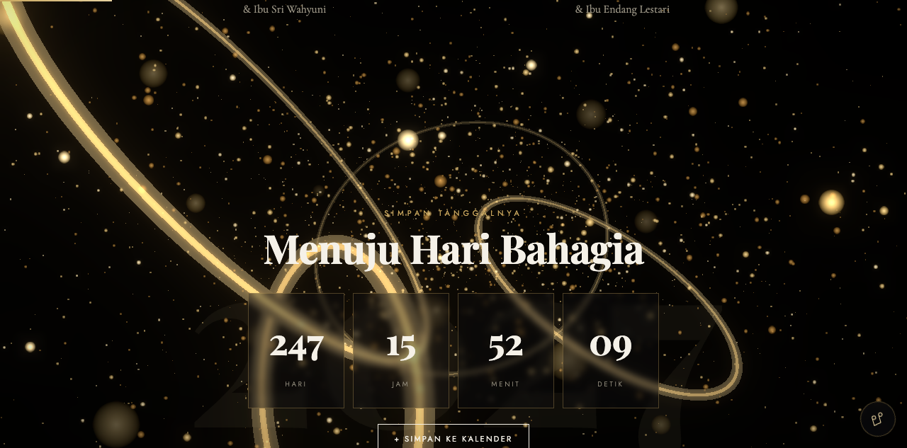
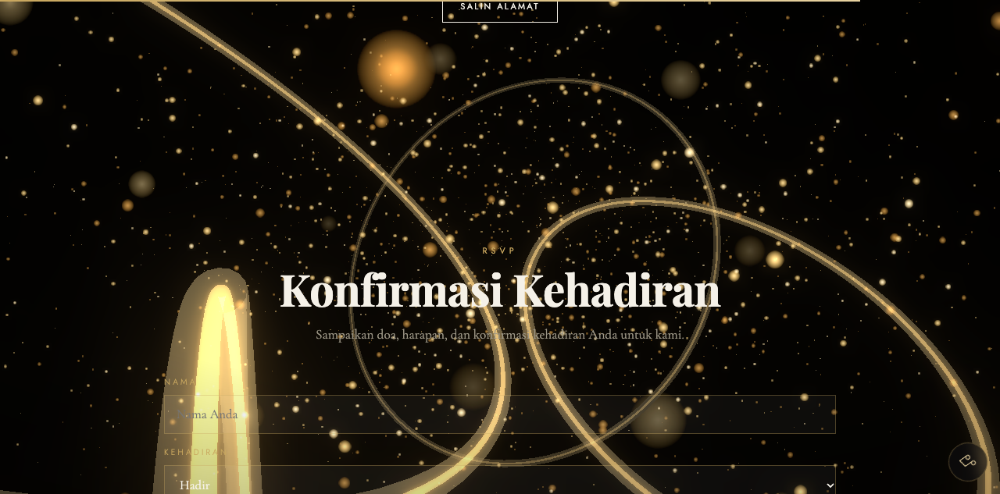
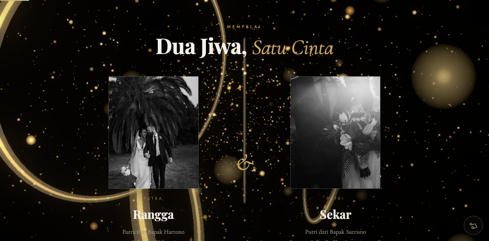

<div align="center">

# Undangan Pernikahan Digital 3D Sinematik

**Partikel emas bercahaya - Bloom sinematik - Segel lilin interaktif**

WebGL/Three.js - tanpa framework, tanpa build step.
Satu file HTML yang terasa seperti situs pemenang penghargaan.

[Demo Live](https://undangan-3d.pages.dev/demo/?to=Nama%20Tamu) - [Landing + Harga](https://undangan-3d.pages.dev) - [Pesan via WA](https://wa.me/6281387906930)



</div>

---

## Kenapa berbeda

Undangan pasaran: tamu scroll 5 detik, tutup, lupa.

Undangan ini: tamu klik segel lilinnya, ledakan cahaya, partikel emas
bergerak mengikuti jarinya, kamera menyusuri medan cahaya saat scroll,
dan fotonya sendiri tampil sebagai cover sinematik hitam-putih yang
menyatu dengan partikel 3D.

| | |
|:---:|:---:|
|  |  |
|  |  |

## Fitur

- **Pembuka sinematik** - segel lilin emas, nama muncul huruf per huruf, ledakan kunang-kunang saat dibuka
- **Medan partikel WebGL + Unreal Bloom** - cahaya nyata yang bergerak mengikuti sentuhan tamu (4.200 partikel di desktop, versi ringan otomatis di HP)
- **Kamera sinematik** - parallax mouse + dolly menyusuri partikel saat scroll
- **13 seksi lengkap** - profil mempelai, cerita, acara, galeri geser + lightbox, video, dress code, rundown, live stream, amplop digital (rekening + QRIS), RSVP, buku tamu
- **Nama tamu otomatis** - setiap tamu melihat namanya sendiri: `?to=Nama%20Tamu`
- **Fallback elegan** - tanpa WebGL? otomatis tampil versi gradient yang tetap mewah

## Live Demo

```
https://undangan-3d.pages.dev/demo/?to=Nama%20Tamu
```
Ganti `to=` dengan nama siapa pun - cover langsung menyapa tamunya.

## Gratis: template 2D open source

Butuh versi ringan tanpa efek 3D? Ada template gratis di repo terpisah:
[arapcihuy/undangan-gratis-2d](https://github.com/arapcihuy/undangan-gratis-2d)

## Struktur

```
site/                  landing page + demo 3D (deploy ke Cloudflare Pages)
template-2d-elegan/    versi 2D tanpa WebGL, ringan untuk HP lama
KIT-PEMASARAN.md       harga, konten IG/TikTok, templat DM, alur order
docs/                  screenshot
```

## Pakai untuk klien sendiri

1. Copy folder `site/demo/`, ganti `assets/` dengan foto klien
2. Edit nama, tanggal, rekening di `index.html`
3. Drag & drop ke [Cloudflare Pages](https://pages.cloudflare.com) - selesai, gratis

## Teknologi

HTML - CSS - Vanilla JS - Three.js r160 (ES Module) - UnrealBloomPass
Playfair Display - Cormorant Garamond - Jost

## Kontak

WhatsApp **0813 8790 6930** - paket mulai Rp 99rb, jadi 1x24 jam.

---

Lisensi: bebas dipakai & dimodifikasi untuk proyek pribadi maupun klien.
Foto demo dari Unsplash (bebas lisensi, tanpa atribusi).
